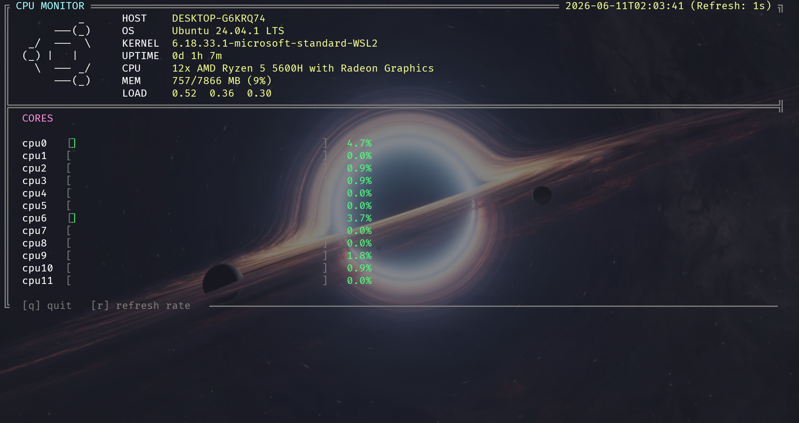

<p align="center">
  
</p>

<h1 align="center">🖥️ CPU Monitor</h1>

<p align="center">
  <b>A beautiful, real-time CPU monitoring tool for your terminal.</b><br>
  <sub>Written in pure Bash — zero dependencies, maximum style.</sub>
</p>

<p align="center">
  <a href="#features"></a>
  <a href="#installation"></a>
  
  
  
</p>

---

## ✨ Features

| Feature | Description |
|---|---|
| 🔄 **Real-time Monitoring** | Per-core CPU usage with configurable refresh rate (0.5s – 5s) |
| 📊 **Live Bar Charts** | Animated, color-coded usage bars — green/yellow/red based on load |
| 🐧 **Distro Detection** | Auto-detects Ubuntu, Debian, Arch, Fedora and displays ASCII art |
| 🖥️ **System Info Panel** | Hostname, OS, kernel, uptime, CPU model, memory usage & load averages |
| 🎨 **Unicode / ASCII Modes** | Beautiful box-drawing characters with automatic ASCII fallback |
| ⚡ **Zero Dependencies** | Pure Bash — no Python, no htop, no external tools needed |
| 📐 **Responsive Layout** | Adapts dynamically to your terminal width on resize |

---

## 📸 Preview

<p align="center">
  
</p>

> **Live dashboard showing:** system info with Ubuntu ASCII art, 12-core CPU utilization bars, memory usage, load averages, and real-time timestamps.

---

## 📦 Installation

### Quick Start (one command)

```bash
curl -fsSL https://raw.githubusercontent.com/<your-username>/cpu-monitor/main/cpu.sh -o cpu.sh && chmod +x cpu.sh && ./cpu.sh
```

### Clone & Run

```bash
git clone https://github.com/<your-username>/cpu-monitor.git
cd cpu-monitor
chmod +x cpu.sh
./cpu.sh
```

### Manual Download

```bash
# Download the script
wget https://raw.githubusercontent.com/<your-username>/cpu-monitor/main/cpu.sh

# Make it executable
chmod +x cpu.sh

# Run it
./cpu.sh
```

> [!NOTE]
> Replace `<your-username>` with your actual GitHub username in the commands above.

---

## 🚀 Usage

```bash
./cpu.sh
```

### Keyboard Controls

| Key | Action |
|-----|--------|
| `q` | Quit the monitor |
| `r` | Cycle refresh rate: **1s** → **2s** → **5s** → **0.5s** → **1s** |

### Environment Variables

| Variable | Default | Description |
|---|---|---|
| `CPUMON_ASCII` | `0` | Set to `1` to force ASCII mode (no Unicode box-drawing) |
| `CPUMON_UNICODE` | `0` | Set to `1` to force Unicode mode |

```bash
# Force ASCII mode (useful for older terminals)
CPUMON_ASCII=1 ./cpu.sh
```

---

## 🖥️ Supported Platforms

| Platform | Status |
|----------|--------|
| Ubuntu / Debian | ✅ Fully supported (with distro ASCII art) |
| Arch Linux | ✅ Fully supported (with distro ASCII art) |
| Fedora | ✅ Fully supported (with distro ASCII art) |
| Other Linux | ✅ Supported (generic Tux ASCII art) |
| WSL (Windows Subsystem for Linux) | ✅ Fully supported |
| macOS | ❌ Not supported (`/proc/stat` required) |

---

## 🎨 Color Scheme

The monitor uses an intuitive color-coded system for CPU usage bars:

```
🟢 Green   →  0% – 49%   (Low load)
🟡 Yellow  → 50% – 79%   (Moderate load)
🔴 Red     → 80% – 100%  (High load)
```

---

## 🏗️ How It Works

```
┌──────────────────────────────────────────────┐
│                  /proc/stat                  │  ← Linux kernel exposes CPU ticks
└──────────────┬───────────────────────────────┘
               │
               ▼
┌──────────────────────────────────────────────┐
│          Read CPU tick counters               │  ← busy (user+nice+sys+irq+steal)
│          per core each interval               │    idle (idle+iowait)
└──────────────┬───────────────────────────────┘
               │
               ▼
┌──────────────────────────────────────────────┐
│     Delta between samples = real-time %       │  ← Δbusy / (Δbusy + Δidle) × 100
└──────────────┬───────────────────────────────┘
               │
               ▼
┌──────────────────────────────────────────────┐
│     Render colored bars + system info         │  ← ANSI escape codes + box-drawing
│     in alternate screen buffer                │
└──────────────────────────────────────────────┘
```

---

## 🤝 Contributing

Contributions are welcome! Here's how you can help:

1. **Fork** the repository
2. **Create** a feature branch: `git checkout -b feature/my-feature`
3. **Commit** your changes: `git commit -m "Add my feature"`
4. **Push** to the branch: `git push origin feature/my-feature`
5. **Open** a Pull Request

### Ideas for Contributions

- [ ] GPU monitoring support
- [ ] Disk I/O statistics
- [ ] Network throughput display
- [ ] Historical usage graphs
- [ ] Config file support
- [ ] Color theme customization

---

## 📄 License

This project is licensed under the **MIT License** — see the [LICENSE](LICENSE) file for details.

---

<p align="center">
  Made with ❤️ and Bash<br>
  <sub>⭐ Star this repo if you found it useful!</sub>
</p>
